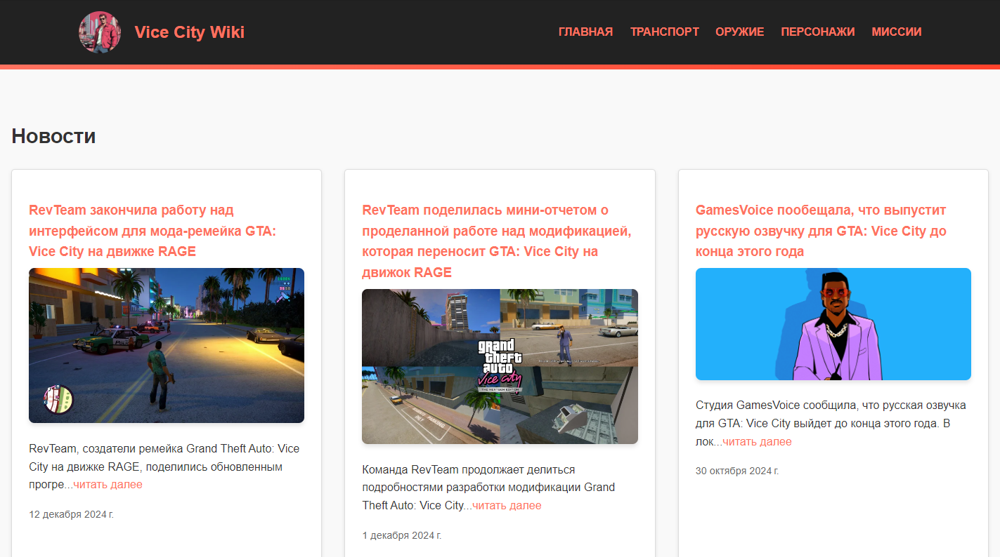

# <center> Gta Vice City Wiki </center>
## Разделы
1. [Описание проекта](#Описание-проекта)
2. [Зависимости](#Зависимости)
3. [Установка проекта](#Установка-проекта)
4. [Использование проекта](#Использование-проекта)
5. [Авторы](#Авторы)

## Описание проекта

> Pet-проект на Flask.




**О структуре проекта:**
* [migrations/](./migrations) - миграции базы данных
* [vc_wiki/](./vc_wiki) - основное приложение
    * [static/](./vc_wiki/static/) - статические файлы
    * [templates/](./vc_wiki/templates/) - HTML шаблоны
    * [\_\_init\_\_.py](./vc_wiki/__init__.py) - инициализация приложения
    * [admin.py](./vc_wiki/admin.py) - инициализация админ панели и её настройки
    * [extensions.py](./vc_wiki/extensions.py) - инициализация сторонних библиотек
    * [models.py](./vc_wiki/models.py) - модели базы данных
    * [routes.py](./vc_wiki/routes.py) - маршруты и их обработка
* [config.py](./config.py) - настройки проекта
* [manage.py](./manage.py) - запуск проекта
* [wiki.db](./wiki.db) - демонстрационные данные


## Используемые зависимости
* Python (3.12.6):
    * [Flask_(3.1.0)](https://palletsprojects.com/projects/flask)
    * [Flask_SqlAlchemy_(3.1.1)](https://flask-sqlalchemy.readthedocs.io/en/stable/)
    * [Flask_Migrate_(4.0.7)](https://flask-migrate.readthedocs.io/en/latest/index.html)
    * [Flask_Admin_(1.6.1)](https://flask-admin.readthedocs.io/en/latest/)
    * [Flask_Babel_(4.0.0)](https://github.com/python-babel/flask-babel/blob/master/docs/index.rst)
    * [WTForms_(3.2.1)](https://wtforms.readthedocs.io/en/main/)
    * [python-slugify_(8.0.4)](https://pypi.org/project/python-slugify/)


## Установка проекта

Клонируйте репозиторий:
```
git clone https://github.com/kirillgt33/GtaVcWiki.git
```
Установите зависимости:
```
pip install -r requirements.txt
```

## Использование проекта
Запустите проект:
```
python manage.py
```

## Авторы

* [Кирилл](https://t.me/KirillGT)
